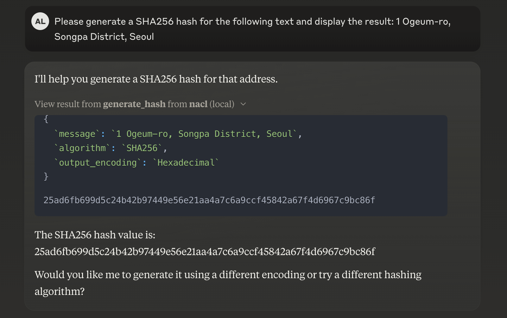
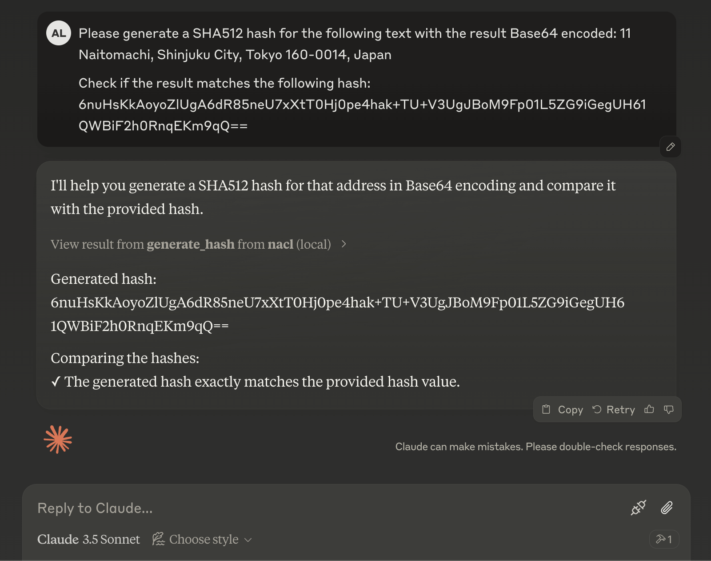

# MCP Server NaCL

***Experimental project to try MCP***

MCP server for [pynacl](https://github.com/pyca/pynacl), exposing cryptographic operations like encryption, decryption and hash functions to MCP clients.

### Model Context Protocol

The [Model Context Protocol](https://modelcontextprotocol.io/introduction) is an open protocol that aims to standardize how we connect AI models to different data sources and tools.

By creating a universal standard, connecting to AI systems becomes simple and reliable. 
Fragmented integrations can be replaced with a single protocol.

The basic architecture:  
- MCP servers expose data/tools  
- MCP clients are AI applications that connect to MCP servers to consume data/tools.

### Tools

- `generate_hash()`
Generates a hash value for a given message using a given algorithm (SHA256, SHA512).

### Setup

`claude_desktop_config.json`:

```json
{
  "mcpServers": {
    "nacl": {
      "command": "<absolute-path-to>/uv",
      "args": [
        "run",
        "--with",
        "mcp",
        "--with",
        "pynacl",
        "<absolute-path-to>/mcp-server-nacl/src/mcp_server_nacl/server.py"
      ]
    }
  }
}
```

### Results


