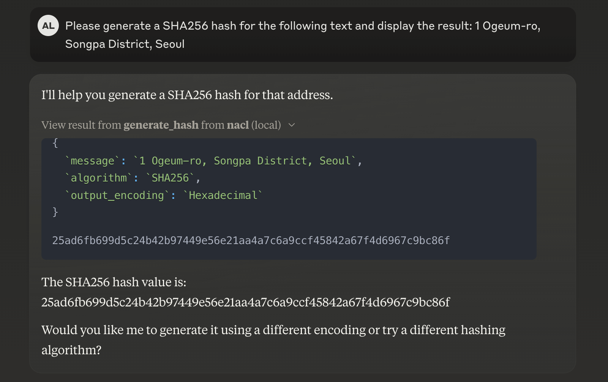
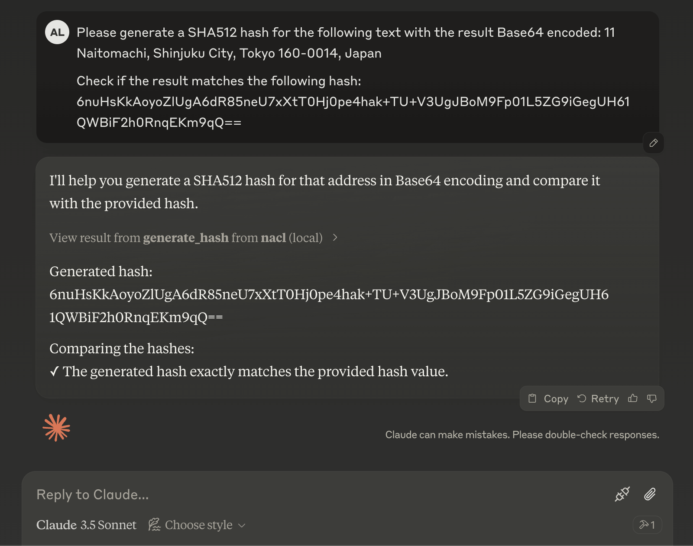

# MCP Servers

## Model Context Protocol

The [Model Context Protocol](https://modelcontextprotocol.io/introduction) is an open protocol that aims to standardize how we connect AI models to different data sources and tools.

By creating a universal standard, connecting to AI systems becomes simple and reliable. 
Fragmented integrations can be replaced with a single protocol.

The architecture is straightforward:  
- MCP servers expose data/tools  
- MCP clients are AI applications that connect to MCP servers to consume data/tools.

This project will explore this architecture by creating some MCP servers and testing them locally with Anthropic Claude.


## Servers

### NaCl Service

[NaCl](https://nacl.cr.yp.to/) is a library that provides cryptographic operations like encryption, decryption and hash functions. 
[pynacl](https://github.com/pyca/pynacl) is a python wrapper for NaCl used under the hood of this server.

Tools:
- `generate_hash()`
Generates a hash value for a given message using a given algorithm (SHA256, SHA512).


## Results





## Setup

`claude_desktop_config.json`:

```json
{
  "mcpServers": {
    "nacl": {
      "command": "/Users/<username>/.local/bin/uv",
      "args": [
        "run",
        "--with",
        "mcp",
        "--with",
        "pynacl",
        "/Users/<username>/Desktop/mcp-servers/src/nacl_service/server.py"
      ]
    }
  }
}
```